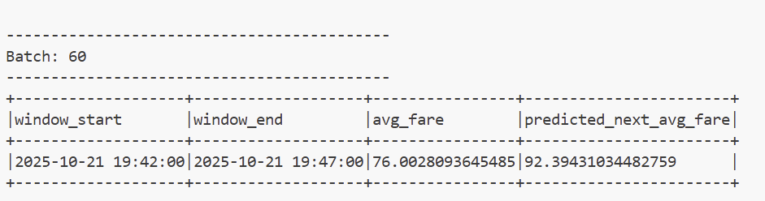

# 2025_ITCS6190_Hands-on_L10
ITCS6190 Cloud Computing for Data Analysis (2025 Fall) Hands-On L10

- **Name:** Kiyoung Kim
- **Student ID:** 801426261  
- **E-Mail:** kkim43@charlotte.edu  

---

## **Project Overview**
This project builds a real-time data analysis system for a ride-sharing platform using **Apache Spark Structured Streaming** and **Spark MLlib**.  
It trains machine learning models to predict fares and identify trends in live ride data.

Main components:
- A Python data generator that sends fake ride data in real time.  
- Spark Structured Streaming for reading and processing data continuously.  
- Spark MLlib for training and applying regression models.

The project includes:  
- **Task 4:** Real-time fare prediction.  
- **Task 5:** Time-based fare trend prediction.  

---

## **Approach**

### Task 4 – Real-Time Fare Prediction
1. Loaded `training-dataset.csv` with ride distances and fares.  
2. Used `VectorAssembler` to build a single feature column from `distance_km`.  
3. Trained a **Linear Regression** model to predict `fare_amount`.  
4. Saved the model to `models/fare_model`.  
5. Started streaming from the socket (`localhost:9999`).  
6. Loaded the trained model and applied it to the live stream.  
7. Calculated the difference between the real and predicted fares.  

**Screenshot:**  

---

### Task 5 – Time-Based Fare Trend Prediction
1. Loaded `training-dataset.csv` and converted `timestamp` to a time format.  
2. Grouped rides into **5-minute windows** and calculated average fare (`avg_fare`).  
3. Added new columns: `hour_of_day` and `minute_of_hour`.  
4. Trained another **Linear Regression** model using these time features.  
5. Saved the model to `models/fare_trend_model_v2`.  
6. In streaming mode, grouped live data with the same 5-minute window.  
7. Applied the saved model to predict the next average fare.  

**Screenshot:**  

---

## **Results Summary**
| Task   | Model Path                     | Description |
|--------|--------------------------------|--------------|
| Task 4 | `models/fare_model`            | Predicts each ride’s fare |
| Task 5 | `models/fare_trend_model_v2`   | Predicts time-based average fare trends |

Both tasks show that the system can handle live streaming data, process it, and make predictions in real time.  

---

## **Conclusion**
This project demonstrates how to combine **data streaming** and **machine learning** in Spark.  
It shows a full workflow from data collection to prediction in a simple and scalable way.
